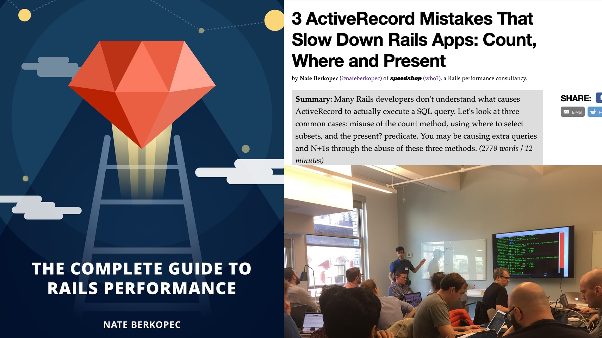
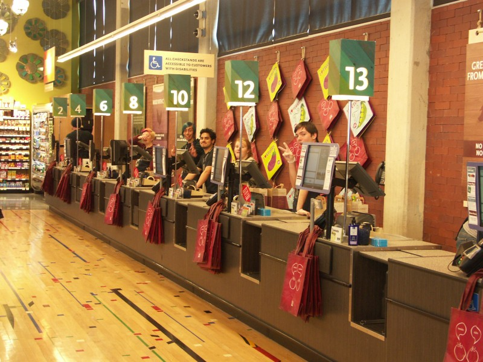
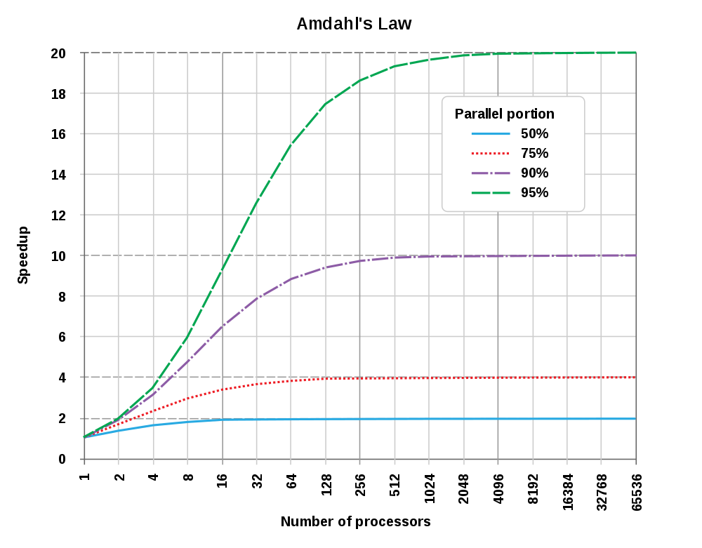

 

---

 

---

---

---

# [fit] How many 
# [fit] servers do you need?

---

# [fit] Improve Customer Experience 
# [fit] Reduce cost to serve traffic

---

# [fit] $K per month

---

# Outline

1. Understanding the math
2. What the math **means**
3. Math Check!
4. Real world application 

---

# 120 requests per minute
# 250 millisecond average 
# 1 second 95th percentile

---

# [fit] Little's 
# [fit] Law 

# Items in System = Arrival Rate X Time In System 

---

---

# Wait times
# Utilization

## 10 customers enter line per minute 
## Takes 1 minute to checkout customer
## 20 checkout counters

---

# An Example with Simple Numbers

## 240 requests per minute (4 r/s)
## 250 millisecond response times (0.25)

---

# [fit] WHAT DOES IT MEAN

---

# [fit] Latency X Throughput = $$$

---

# [fit] Starting point for
# [fit] process counts

---

# [fit] True
# [fit] In the Long Run 

---

# [fit] Understanding
# [fit] Request Queues in Ruby Web Apps

---

# [fit] Load Balancer
# [fit] Nginx (optional)
# [fit] Unicorn

---

# [fit] Scaling Reduces Wait Times
# [fit] for a free Ruby process
# [fit] Not Response Times  

---

# [fit] Autoscaling 
# [fit] Must be based on wait times 

---

# [fit] How To Find
# [fit] Request Queue Times

---

# [fit] easy to see underscaling
# [fit] hard to see overscaling

--- 

# [fit] Predictable response times
# [fit] are Scalable Response Times

---

# [fit] Story:
# [fit] reducing wait times on a high 95-th app

---

# [fit] What We Know So Far

## WIP = Latency * Arrival Rate
## Scaling Reduces Queue  
## Predictable is Scalable
## Where Requests Queue

---

# [fit] Twitter, 2008

* 600 requests/second
* 180 application processes (mongrel)
* About 300ms average server response time

---

# [fit] Shopify, 2013

* Shopify receives 833 requests/second.
* They average a 72ms response time
* They run 53 application servers with a total of 1172 application processes (!!!) with NGINX and Unicorn.

---

# [fit] Envato, 2013

* Envato receives 115 requests per second
* They run an average of 147ms response time
* They run 45 processes

---

# [fit] Average Response Time X 4 X
# [fit] Request Arrival Rate = 
# [fit] Ruby Process Count

## Threads are bonus
## Adjust based on request queue times

---

# [fit] 100 requests/sec
# [fit] 200 ms avg resp
# [fit] 80 processes

---

# 80 processes
# 2 processes per core 
# 4+ core servers
# 80/8 = 10 4-core servers with 8 processes each

---

# [fit] Why the process?

---

# [fit] GVL

---

---

# [fit] Container Story

---

# [fit] Other Services
# [fit] Background Jobs

---

# [fit] Other Services
# [fit] DB, JRuby, Languages 

---

# [fit] Guilds = Processes. --mem
# [fit] AutoFiber = Threads

---

# [fit] Checkin: What We Know

## Little's Law 
## How Request Queues Work
## How to Provision
## How to Save $$$

---

# [fit] Thank you!
# @nateberkopec
# More tactics at:
# railsspeed.com
